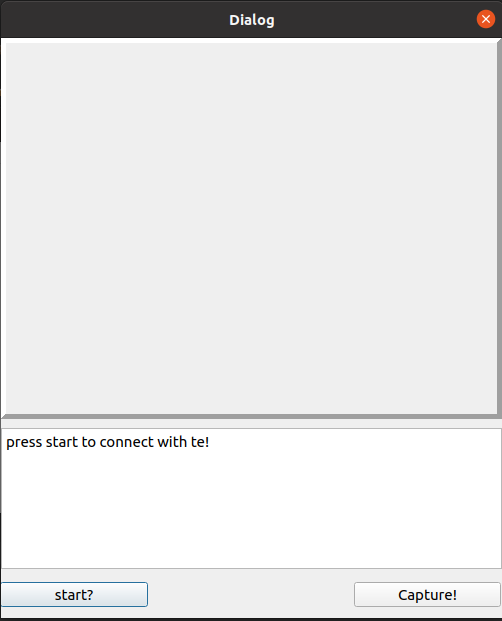

#Camera UI
created for using TE thermal camera,

but only ended up in creating simple gui to use webcam 

press start to start webcam, 
press capture to save capture image

captured images are saved in images folder
